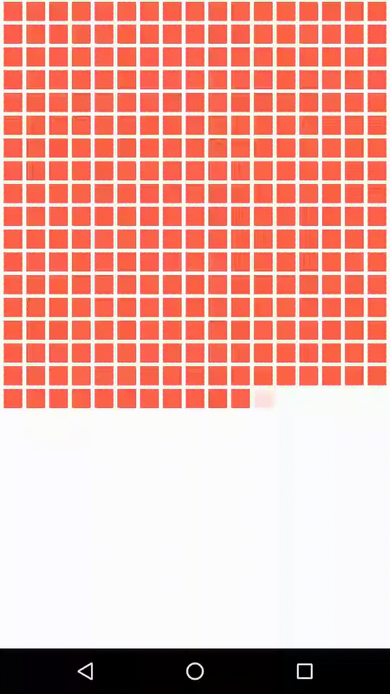

# expo-animations

> Simple animations using Expo

Follow [this tutorial](https://medium.com/react-native-training/react-native-animations-using-the-animated-api-ebe8e0669fae) to build them.

Switch branches to get the following results.

# 01. Infinite Animations

See branch [01-infinite](../../tree/01-infinite-animations)

# 02. Easing

See branch [02-easing](../../tree/02-easing)

# 03. Spring

See branch [03-spring](../../tree/03-spring)

# 04. Parallel

See branch [04-parallel](../../tree/04-parallel)

# 05. Sequence

See branch [05-sequence](../../tree/05-sequence)

# 06. Stagger

See branch [06-stagger](../../tree/06-stagger)

